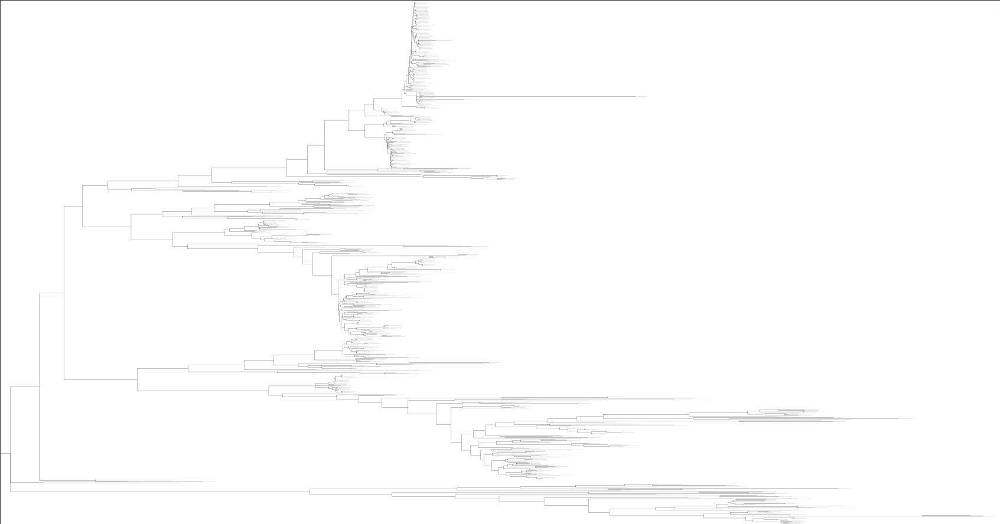
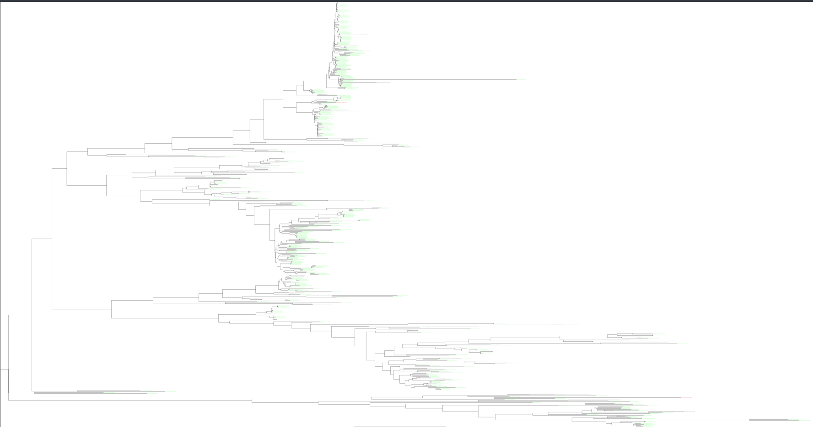
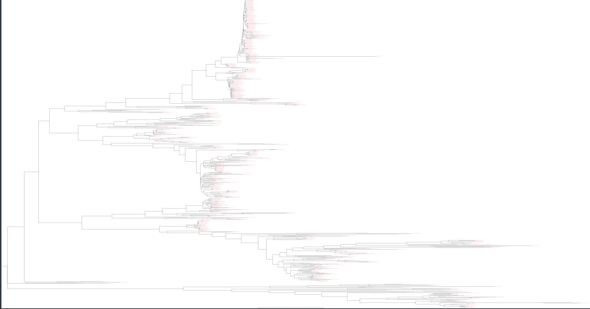
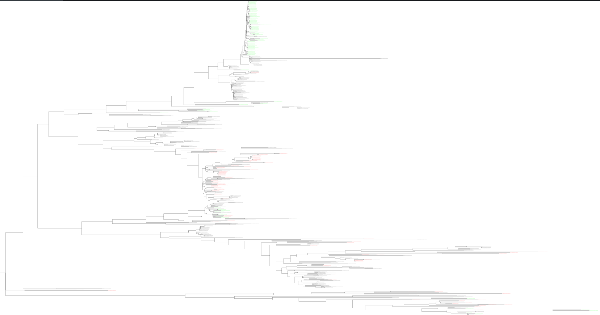
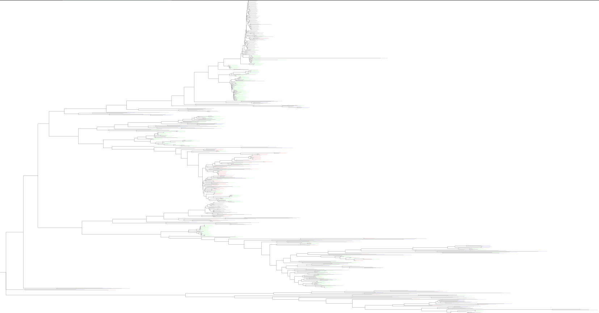

# The Characterization of Variants of Unknown Significance on the ADNP Gene Based on Computational Genomics Methods

## Authors
<ul>
    <li> Mehmet Arda Müftüoğlu </li>
    <li> Betül Koç </li>
    <li> Bora Tarlan </li>
</ul>

## Introduction

ADNP Syndrome is a rare Mendelian type disease which is one of the causes of Autism Spectrum Disorder. The disease is identified by a gene truncation event on the ADNP gene and diagnosed based on clinical suspicion risen by a developmental delay observed in patients(Cappuyns et al., 2018; NORD, 2021). In addition to the mentioned growth impediment in subjects, the disease which is considered a complex neuro-developmental disorder affects the cognitive and bodily functions of the patients as well. Due to its symptoms that fall under the more generic condition of Autism, the diagnosis of the syndrome requires molecular genetic testing. The study done by Bend et al. (2019) focuses on a model that makes use of DNA methylation episignatures found in peripheral blood samples to be able to predict whether undiagnosed patients with developmental delay have ADNP Syndrome or not. The study also mentions that clinical experiments identify Variants of Unknown Significance (VUS), in the protein sequences of patients with ADNP Syndrome which can be defined as observed substitutions in the patients who have the disease in comparison to the known healthy and functioning ADNP genes. Our project aim is to characterize these variants that are VUS as allowed or pathogenic ones. This characterization will be based on the analysis of the healthy version of the ADNP gene's level of preservation among the homologous proteins in comparison to the observed versions of the gene responsible for ADNP Syndrome. Specifically, the positions where an amino acid substitution labeled as a VUS happened and its ratio of conservation will be considered.

The ADNP protein is a transcription factor which regulates gene expression during development. Protein contains a conserved DNA-binding domain called the homeodomain which is located at the N-terminal. This domain allows ADNP to bind specific DNA sequences and regulate the expression of the target. ADNP contains several critical residues such as polar residues between sites 356-443, 693-712, 972-986, 1043-1074, as well as basic and acidic residues between 851-876, 903-967, 1003-1023. These residues play role in homeodomain, protein-protein interactions, and post-translational modification. The ADNP protein is evolutionarily conserved across a wide range of species, including humans.

## Results

In order to classify the VUS as gaps, pathogenic, or allowed, more additional information is required about the clinical context in which they were identified, and their potential impact on the ADNP protein and brain function. Here are some general guidelines that could be used to classify the VUS based on the results of the computational analysis:

Gaps: VUS that are predicted to have a neutral or benign effect on protein function and are located in regions of the protein that are not evolutionarily conserved or structurally important could be classified as gaps. These VUS may not be of clinical significance and may not require further investigation.
Pathogenic: VUS that are predicted to be disruptive to protein function, are located in evolutionarily conserved or structurally important regions of the protein, and have been associated with neurological disorders in published literature or in the ClinVar database could be classified as pathogenic. These VUS may have a significant impact on brain function and may be worthy of further investigation and clinical consideration.
Allowed: VUS that are predicted to have a neutral or benign effect on protein function, are located in regions of the protein that are not evolutionarily conserved or structurally important, and have not been associated with neurological disorders could be classified as allowed. These VUS may not have a significant impact on brain function and may not require further investigation.
It is important to note that these classifications are provisional and should be used as a starting point for further investigation. The functional consequences of VUS may not always be accurately predicted by computational tools, and experimental studies may be necessary to confirm their functional impact. Additionally, the clinical significance of a VUS may depend on other factors, such as the presence of additional genetic risk factors or environmental exposures.

In this project, the aim was to characterize variants of unknown significance (VUS) on the ADNP gene based on computational genomics methods. To do this, a BLAST search against the ADNP protein in the RefSeq database was performed, and low complexity regions and isoforms were filtered out. This filtering resulted in 504 hits remaining from 1000 hits obtained by the BLAST search. Then, using MUSCLE a multiple sequence alignment on the remaining hits was performed and a FASTA file was obtained.

Using the findconservation.py script, dictionaries for both the MSA and the VUS were created, with the key being the index of the change and the value showing what the original amino acid was and what it was changed to. A BLOSUM dictionary from the internet was also obtained and using all the previous data a VUS metrics file to hold the Original and Substitution Values' identity, positive, zero, negative, and gap values were collected.

The tree was imported into FigTree, rooted at the middle point, and then colored according to their scores. For example, VUS#1 was initially classified as pathogenic, but upon substitution analysis, a more negative BLOSUM score result was obtained. In VUS#12, which is the substitution of aspartic acid with asparagine is predicted to have a neutral or benign effect on protein function. It also can be observed that aspartic acid is more similar to humans, as indicated by the higher concentration of green in those parts. When it becomes asparagine, the color on the tree changes from green to blue, which we interpret as a similar chemical transformation.

The first VUS has a glycine in the position where the healthy ADNP gene has an arginine. The BLOSUM score of the glycine - arginine substitution is given as -2. This score alone places doubt on the possibility that the substitution that happened in this VUS is an allowed one since the BLOSUM scores are determined based on statistical data of the known ratio in which a given amino acid pair was substituted. However, this does not necessarily mean that this variant negatively affects the fitness of the gene since it is merely an indication of how likely this event is to happen. On the other hand, the comparison of identity, positive, and negative scores of the substituted amino acid with the 504 BLAST subject sequences in comparison to the score of the amino acid from the healthy or original sequence further support the claim that this is not an allowed substitution. The characterization of this VUS as pathogenic does have a high confidence rate as well since the arginine has 0.97 identity and positive scores to our pool of subject homologous sequences while positive and identity scores for glycine in position 16 are zero.

VUS#1 Original             |  VUS#1 Substituted
:-------------------------:|:-------------------------:
 | 

The substitution of glycine with serine in VUS #6 could be categorized as an allowed amino acid substitution. The BLOSUM62 score for this particular substitution is 0, indicating that it is possibly a neutral substitution and may not significantly affect the protein structure or function. However, this conclusion is not definitive by the BLOSUM score alone, as the scores for the substituted amino acid serine against subject sequences should help validate it. The comparison of identity, positive, and negative scores between the original and substituted amino acid also goes to show the high possibility that this substitution is allowed. The identity score for serine in this position is slightly higher than that of glycine as well as a considerably higher positive rate for serine, implying a higher degree of similarity to the subject homologous sequences. While this substitution may not be a common occurrence, the data suggests that it is an allowed substitution. The unexpected figure in the data is how low the identity and positive scores for glycine are in the first place. Considering the fact that glycine is the amino acid observed on the protein produced by the healthy ADNP gene used as a reference, for it to have low scores such as 0.26 for positive/ identity scores seems counterintuitive. On this note, it is crucial to remember that the scores in our data are created by the homologous proteins of other species. Therefore it only gives us an idea about the likelihood of a substitution event from an evolutionary perspective.

VUS#6 Original             |  VUS#6 Substituted
:-------------------------:|:-------------------------:
 | 

## Discussion

The aim of this project was to classify variants of unknown significance (VUS) on the Activity-dependent Neuroprotector Homeobox Protein (ADNP) gene in Homo sapiens as gaps, pathogenic, or allowed using computational biology methods. We proposed to do this by considering the conservation of the amino acid in the given position and the substituted amino acid in homologous proteins. This classification of VUS in the ADNP gene may benefit treatment for ADNP Syndrome and guide clinical decisions.

There are several limitations to this approach. The functional consequences of VUS may not be accurately predicted solely by computational analysis. The clinical significance of a VUS may depend on factors such as additional genetic factors and environmental exposures. In addition, to improve the accuracy of VUS classification, additional data sources would be useful such as cell-based assays which means experiments that use living cells to investigate the functional consequences or predictive algorithms that are trained on the known data. 

In conclusion, these classifications of VUS provide insights into the molecular basis of ADNP Syndrome. However, it is important to accept that this approach needs additional data sources and algorithms or computational tools to further improve the accuracy of the characterization process. 

## Materials and Methods

The sequence of the ADNP gene was obtained from the UniProt (Q9H2P0 · ADNP_HUMAN) database in FASTA format. The p-BLAST algorithm (Jones et al., 1991) was used to search the RefSeq protein database for homologous sequences to the ADNP gene. The search was performed using the default parameters, except for the low-complexity region filter and a hit number of 1000. A total of 1000 hits were obtained from this query. 

The results of the p-BLAST query included isoform sequences, so the results were filtered to exclude these sequences. After filtering the results with a Python code, 504 sequences remained out of 1000 sequences of the initial results. Multiple sequence alignment (MSA) was performed on these 504 sequences using the Muscle algorithm (Edgar, 2004) with default parameters using MEGA11 (Kumar et al., 2021). 

Variants of unknown significance (VUS) data for the ADNP gene were obtained from the Leiden Open Variation Database (LOVD) (Unique Variants in the ADNP Gene - Global Variome Shared LOVD, n.d.). A total of 12 VUS were identified in the LOVD database for the ADNP gene, which was a result of a single substitution of an amino acid. The VUS data included the position of the mutation, the original amino acid, and the substituted amino acid. The position of the substitution in the MSA result was calculated for each VUS. The amino acids of VUS data were compared with respect to their BLOSUM62 (Henikoff & Henikoff, 1992) score in the given position of the MSA.

For each VUS and both the original and substituted amino acids, the ratios of identity, positive BLOSUM62 scores, negative BLOSUM62 scores, zero BLOSUM62 scores, and gaps were calculated for the given position in the MSA by comparing amino acids in sequences for all species in the MSA.

A phylogenetic tree was constructed using the maximum likelihood method (Felsenstein, 1981) with default parameters, except for a bootstrap value of 10, in MEGA11 (Kumar et al., 2021). The tree was rooted at the middle point and visualized using FigTree (Rambaut, 2007). For each original and substituted amino acid of all VUS, the leaves of the phylogenetic tree were colored according to the amino acid comparison results: green for identity, blue for positive BLOSUM62 scores, red for negative BLOSUM62 scores, and black for gap and zero BLOSUM62 scores.

## References

- Bend, E. G., Aref-Eshghi, E., Everman, D. B., Rogers, R. C., Cathey, S. S., Prijoles, E. J., Lyons, M. J., Davis, H., Clarkson, K., Gripp, K. W., Li, D., Bhoj, E., Zackai, E., Mark, P., Hakonarson, H., Demmer, L. A., Levy, M. A., Kerkhof, J., Stuart, A., & Rodenhiser, D. (2019). Gene domain-specific DNA methylation episignatures highlight distinct molecular entities of ADNP syndrome. Clinical Epigenetics, 11(1). https://doi.org/10.1186/s13148-019-0658-5

- Cappuyns, E., Huyghebaert, J., Vandeweyer, G., & Kooy, R. F. (2018). Mutations in ADNP affect expression and subcellular localization of the protein. Cell cycle (Georgetown, Tex.), 17(9), 1068–1075. https://doi.org/10.1080/15384101.2018.1471313

- Edgar, R. C. (2004). MUSCLE: a multiple sequence alignment method with reduced time and space complexity. BMC Bioinformatics, 5, 113.

- Felsenstein, J. (1981). Evolutionary trees from DNA sequences: a maximum likelihood approach. Journal of Molecular Evolution, 17, 368–376.

- Henikoff, S., & Henikoff, J. (1992). Amino acid substitution matrices from protein blocks. Proceedings of the National Academy of Sciences, 89(22), 10915–10919.

- Jones, D. T., Miller, W., & Waterman, M. S. (1991). pBLAST: a program to facilitate position-based sequence database searching. Nucleic Acids Res., 19(19), 6409–6416.

- Kumar, S., Stecher, G., & Tamura, K. (2021). MEGA11: Molecular evolutionary genetics analysis version 11.7. Molecular Biology and Evolution, 38(1), 245–249.

- National Organization for Rare Disorders. (2021, November 8). ADNP syndrome. https://rarediseases.info.nih.gov/diseases/12931/adnp-syndrome

- Rambaut, A. (2007). FigTree v1.3.1. Department of Biological Sciences, University of Edinburgh.

- Unique variants in the ADNP gene - Global Variome shared LOVD. (n.d.). Databases.lovd.nl. Retrieved January 1, 2023, from https://databases.lovd.nl/shared/variants/ADNP/unique#object_id=VariantOnTranscriptUnique%2CVariantOnGenome&id=ADNP&order=VariantOnTranscript%2FDNA%2CASC&search_transcriptid=00024223&search_VariantOnGenome/ClinicalClassification=VUS&page_size=100&page=1